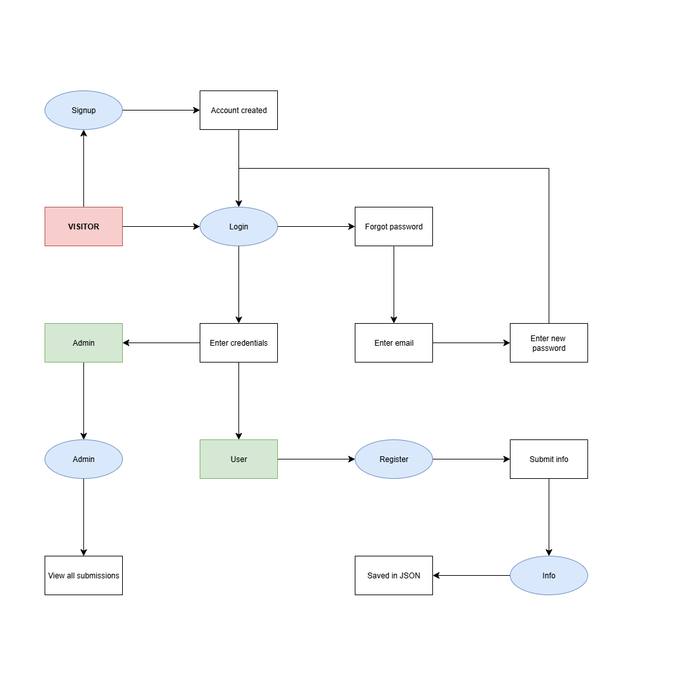

# Flask Authentication & Admin Dashboard Web App

- A Flask-based web application that provides **user signup, login, password reset, user info submission, and admin dashboard**.  
- Built with **Flask, Bootstrap 5, and JSON storage** (no SQL database required).

---

## 🚀 Features

- 🔑 **User Authentication**
  - Signup with ID, password, and personal details
  - Login & Logout
  - Role-based access (user vs admin)

- 🔐 **Password Management**
  - Forgot password via email lookup
  - Reset password using a token link

- 📝 **User Info Submission**
  - Registered users submit details (age, education, address, phone, work experience, certificates)
  - Data stored as JSON in `scraped/` folder

- 📊 **Admin Dashboard**
  - View all submitted data
  - Export submissions as CSV

- 🎨 **Responsive UI**
  - Built with **Bootstrap 5** and **Font Awesome**

---

## 📂 Project Structure
```
project/
├── app_2.py          # Main Flask application
├── users.json        # User data storage
├── scraped/          # Submitted user info
│   ├── scraped_user_*.json
│   └── all_scraped.json
├── templates/        # HTML templates
│   ├── base.html
│   ├── signup.html
│   ├── login.html
│   ├── reset.html
│   ├── forgot_result.html
│   ├── register.html
│   ├── info.html
│   └── admin.html
├── static/           # CSS/JS files (optional)
└── README.md         # Project documentation
```
---

## ⚙️ Installation & Setup

### 1. Clone the repository
```bash
git clone https://github.com/yourusername/your-repo.git
cd your-repo
```
### 2. Create a virtual environment
```
python -m venv venv
source venv/bin/activate   # Mac/Linux
venv\Scripts\activate      # Windows
```
### 3. Install dependencies
```
pip install flask beautifulsoup4 werkzeug
```
or
```
pip install -r requirements.txt
```
### 4. Run the app
```
python app_2.py
```
Open in browser: http://127.0.0.1:5000

---
### 🗂 Workflow Diagram


---
### 🧾 Usage
1. Sign up with /signup
2. Login at /login
3. Regular users:
   - Go to /register → Click Submit Info
   - View submitted info at /info
4. Admin users:
   - Access /admin → View all submissions
---
### 🔑 Admin Instructions

To make a user an admin:

 1. Open users.json
 2. Change "role": "user" → "role": "admin"

---
### ⚠️ Security Notes
- Passwords are stored in plain text. For production, use werkzeug.security.generate_password_hash & check_password_hash.
- No real email service configured; password reset link is shown directly in the app.
