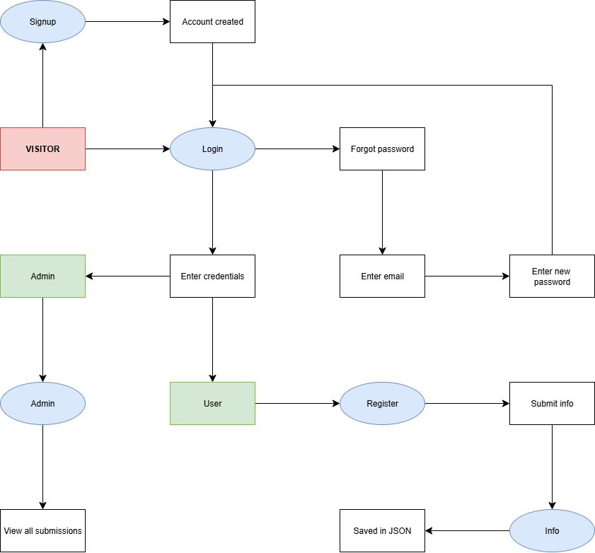

# Flask 인증 및 관리자 대시보드 웹 앱

- **Flask 기반 웹 애플리케이션**으로, 사용자 가입, 로그인, 비밀번호 재설정, 사용자 정보 제출, 관리자 대시보드 기능을 제공합니다.  
- **Flask, Bootstrap 5, JSON 저장소**를 사용해 구축되었으며, SQL 데이터베이스가 필요 없습니다.

---

## 🚀 기능

- 🔑 **사용자 인증**
  - ID, 비밀번호, 개인 정보를 통한 가입
  - 로그인 및 로그아웃
  - 역할 기반 접근 (일반 사용자 vs 관리자)

- 🔐 **비밀번호 관리**
  - 이메일 조회를 통한 비밀번호 찾기
  - 토큰 링크를 사용한 비밀번호 재설정

- 📝 **사용자 정보 제출**
  - 등록된 사용자가 세부 정보(나이, 학력, 주소, 전화번호, 경력, 자격증)를 제출
  - 데이터는 `scraped/` 폴더에 JSON 형식으로 저장

- 📊 **관리자 대시보드**
  - 제출된 모든 데이터 조회
  - 제출 데이터를 CSV로 내보내기

- 🎨 **반응형 UI**
  - **Bootstrap 5** 및 **Font Awesome**으로 구축

---

## 📂 프로젝트 구조
```
project/
├── app_2.py          # 메인 Flask 애플리케이션
├── users.json        # 사용자 데이터 저장소
├── scraped/          # 제출된 사용자 정보
│   ├── scraped_user_*.json
│   └── all_scraped.json
├── templates/        # HTML 템플릿
│   ├── base.html
│   ├── signup.html
│   ├── login.html
│   ├── reset.html
│   ├── forgot_result.html
│   ├── register.html
│   ├── info.html
│   └── admin.html
├── static/           # CSS/JS 파일 (선택 사항)
└── README.md         # 프로젝트 문서
```

---

## ⚙️ 설치 및 설정

### 1. 저장소 복제
```bash
git clone https://github.com/yourusername/your-repo.git
cd your-repo
```

### 2. 가상 환경 생성
```bash
python -m venv venv
source venv/bin/activate   # Mac/Linux
venv\Scripts\activate      # Windows
```

### 3. 종속성 설치
```bash
pip install flask beautifulsoup4 werkzeug
```
또는
```bash
pip install -r requirements.txt
```

### 4. 앱 실행
```bash
python app_2.py
```
브라우저에서 열기: http://127.0.0.1:5000

---

### 🗂 워크플로우 다이어그램
<br></br>


---

### 🧾 사용 방법
1. `/signup`에서 가입
2. `/login`에서 로그인
3. 일반 사용자:
   - `/register`로 이동 → 정보 제출 클릭
   - `/info`에서 제출된 정보 조회
4. 관리자 사용자:
   - `/admin`으로 이동 → 모든 제출 데이터 조회

---

### 🔑 관리자 지침

사용자를 관리자로 설정하려면:

1. `users.json` 파일을 열기
2. `"role": "user"`를 `"role": "admin"`으로 변경

---

### ⚠️ 보안 주의사항
- 비밀번호는 평문으로 저장됩니다. 실제 배포 환경에서는 `werkzeug.security.generate_password_hash` 및 `check_password_hash`를 사용하세요.
- 실제 이메일 서비스는 설정되지 않았으며, 비밀번호 재설정 링크는 앱에서 직접 표시됩니다.

---
# Flask Authentication & Admin Dashboard Web App

- A Flask-based web application that provides **user signup, login, password reset, user info submission, and admin dashboard**.  
- Built with **Flask, Bootstrap 5, and JSON storage** (no SQL database required).

---

## 🚀 Features

- 🔑 **User Authentication**
  - Signup with ID, password, and personal details
  - Login & Logout
  - Role-based access (user vs admin)

- 🔐 **Password Management**
  - Forgot password via email lookup
  - Reset password using a token link

- 📝 **User Info Submission**
  - Registered users submit details (age, education, address, phone, work experience, certificates)
  - Data stored as JSON in `scraped/` folder

- 📊 **Admin Dashboard**
  - View all submitted data
  - Export submissions as CSV

- 🎨 **Responsive UI**
  - Built with **Bootstrap 5** and **Font Awesome**

---

## 📂 Project Structure
```
project/
├── app_2.py          # Main Flask application
├── users.json        # User data storage
├── scraped/          # Submitted user info
│   ├── scraped_user_*.json
│   └── all_scraped.json
├── templates/        # HTML templates
│   ├── base.html
│   ├── signup.html
│   ├── login.html
│   ├── reset.html
│   ├── forgot_result.html
│   ├── register.html
│   ├── info.html
│   └── admin.html
├── static/           # CSS/JS files (optional)
└── README.md         # Project documentation
```
---

## ⚙️ Installation & Setup

### 1. Clone the repository
```bash
git clone https://github.com/yourusername/your-repo.git
cd your-repo
```
### 2. Create a virtual environment
```
python -m venv venv
source venv/bin/activate   # Mac/Linux
venv\Scripts\activate      # Windows
```
### 3. Install dependencies
```
pip install flask beautifulsoup4 werkzeug
```
or
```
pip install -r requirements.txt
```
### 4. Run the app
```
python app_2.py
```
Open in browser: http://127.0.0.1:5000

---
### 🗂 Workflow Diagram
<br></br>


---
### 🧾 Usage
1. Sign up with /signup
2. Login at /login
3. Regular users:
   - Go to /register → Click Submit Info
   - View submitted info at /info
4. Admin users:
   - Access /admin → View all submissions
---
### 🔑 Admin Instructions

To make a user an admin:

 1. Open users.json
 2. Change "role": "user" → "role": "admin"

---
### ⚠️ Security Notes
- Passwords are stored in plain text. For production, use werkzeug.security.generate_password_hash & check_password_hash.
- No real email service configured; password reset link is shown directly in the app.
